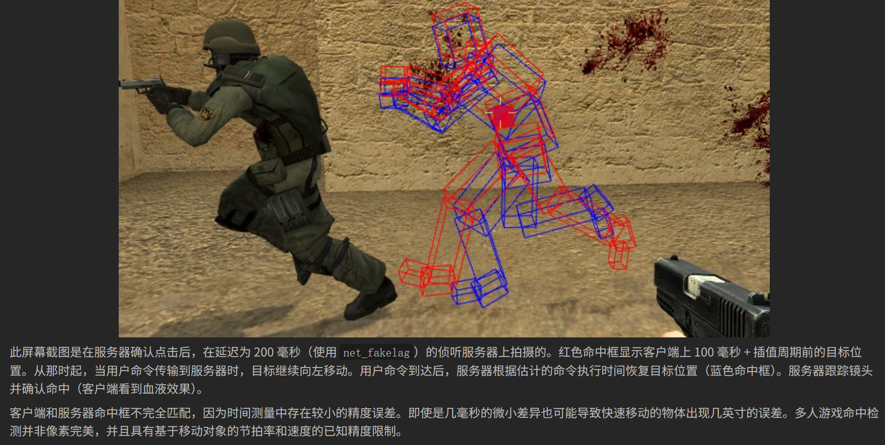
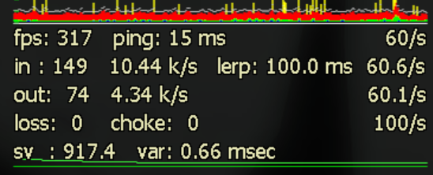

## 首先明确两个概念: <u>服务器计算</u>和<u>服务器发包</u>

### 服务器计算(也称为tick)
tick是启动项 -tickrate设置的值, 代表每秒服务器计算世界变动的次数. **跟服务器cpu性能挂钩**
30tick, 每秒计算30次世界变动, 每0.033秒更新一次世界变动
60tick, 每秒计算60次世界变动, 每0.016秒更新一次世界变动
100tick, 每秒计算100次世界变动, 每0.01秒更新一次世界变动

### 服务器发包(也称为update)
update是sv_minupdaterate和sv_maxupdaterate控制的值, 代表服务器每秒向玩家广播的次数. **跟服务器带宽挂钩**
假设sv_minupdaterate,sv_maxupdaterate相同的情况(一般max比min大1较好)
sv_maxupdaterate  = 30, 限制服务器每秒向客户端发送发送的数据包次数30次, 每0.033秒发送一次
sv_maxupdaterate  = 60, 限制服务器每秒向客户端发送发送的数据包次数60次, 每0.016秒发送一次
sv_maxupdaterate  = 100, 限制服务器每秒向客户端发送发送的数据包次数为100次, 每0.01秒发送一次

*请注意: 服务器并不会立马将计算好的tick发包, 而是根据发包间隔来发送.*

---

### 理解了上面的前提, 接下来看一个最理想的案例:
假设服务器设置为100tick(tickrate 100), minupdaterate 和 maxupdaterate均为100的情况下, 不考虑玩家A的延迟, A的cl_updaterate接收包速率也是100
此时服务器每**0.01s**计算一次tick, 每**0.01s**发送一次数据

假设A客户端只渲染其当前接受到的数据包的世界数据, 那么就会发生下面的状况.
由于服务器是每0.01秒就要发送一次世界更新, 但是延迟导致每次世界更新都要在服务器时间+0.05s之后才会送到
如下所示(请注意, **时间是连续的**, 我以0.005s为间隔跳跃以便展示.)  

|           | 1.000s | 1.005s | 1.010s | 1.015s | 1.020s | 1.025s | 1.030s | ... | 1.090s | 1.095s | 1.100s |
| --------- | ------ | ------ | ------ | ------ | ------ | ------ | ------ | ------ | ------ | ------ | ------ |
| SERVER    | 开始计算tick1的世界数据  | 该tick计算量少, 提前完成,等待发包,等待计算tick2 | 发送tick1数据, 开始计算tick2的世界数据 | 计算tick2中 | tick2计算量较大,完成时间与发包时间相同, 发送tick2数据, 同时开始计算tick3| ... | 发送tick3数据, 计算tick4 | ... | 发送tick9, 计算tick10 | ... | 发送tick10, 计算tick11 |
| CLIENT    | [初始游戏画面]                    | 等待                                    | 等待                                 | 等待         | 接收到tick1, 开始渲染                                                       | 等待 | 接收到tick2, 开始渲染 | ... | 接收到tick8, 开始渲染 | 等待 | 接收到tick9, 开始渲染 |

可以看到, **如果只渲染当前tick的世界数据**, 当网络出现波动时, 比如1.030s本应收到的tick2世界数据, 如果玩家延迟增加或者干脆直接丢包, 那么玩家的游戏画面就会因为没有未来数据而无法进行渲染, 从而导致玩家的操作与画面出现断档, 使画面看起来断断续续的卡顿.

问题已经清楚, 那么要如何改进呢?
> 	[WIKI](https://developer.valvesoftware.com/wiki/Source_Multiplayer_Networking)  Source 引擎服务器为了应对网络通信带来的问题，采用了客户端不可见的数据压缩和**滞后补偿**等技术。然后，**客户端执行预测和插值**以进一步改善体验。

这句话我们从后往前看来慢慢解释:

1. **客户端插值(cl_interp/lerp):**
   从上面的例子可以理解到, 如果客户端只渲染当前时间接受到的数据包, 那么一旦网络波动, 玩家就会立马感受到画面出现变形卡顿. 为此, Source引擎区分了客户端的**渲染时间**以及**当前帧时间**(也可以理解为逻辑时间). **将渲染时间滞后于客户端实际时间.** 
    
   * 假设客户端时间在1.140s, 客户端实际渲染的时间点是并不是当前的1.140s接受的tick世界数据, 而是渲染往前推了**cl_interp**对应的值. 比如cl_interp 0.1就代表渲染时间滞后于客户端逻辑时间100ms(0.1s). 也就是说, 此时实际渲染的是1.040s的时的数据, 也就是tick3的世界数据.
   * 此时, 由于实际逻辑时间是1.140s. 即便客户端**之前**因为丢包或者延迟没有接收到1.050s的tick4, 1.060的tick5, 客户端也可以根据tick3, 后续的tick6, 7, 8等反推出tick4, 5的世界数据应该是什么样的. 等渲染时间走到1.050s时, 渲染程序就可以根据推算出的世界数据渲染, 从而解决由于网络波动带来画面卡顿.
     
2. **客户端行为预测(cl_predict)**
   插值虽然解决了画面因为突发网络波动而大幅度变动的情况, 但是只解决了从服务器到客户端的单向通信. 而游戏肯定是要操作的, 而玩家的操作只能影响客户端上的世界数据, 需要将客户端执行的所有usercmd传递给服务器其他玩家才能看到该玩家的操作. 而网络延迟是无法避免的, 那么在客户端提交usercmd到服务器, 服务器根据客户端提供的信息计算tick世界数据后再返回给客户端的这一大段时间内, 客户端只能干等吗? 这里就是客户端预测的功能了. 
    
   * 行为预测, 顾名思义就是客户端根据当前用户的操作立即进行渲染, 不考虑服务器以及其他玩家的操作导致的世界变动. 如果玩家当前的客户端世界数据没有阻止开火时, 当按下开火时客户端立即渲染了开火事件; 没有阻止向前移动时, 按W会立刻向前移动. 因为这些渲染出来的画面都是预测.
   * 正因为其预测没有考虑服务器和其他玩家情况, 假设当前玩家按W往前走的同时正前方生成了一堵墙阻挡(客户端还不知道这个变化), 那么自然是无法正常前进的, 服务器根据所有玩家的情况计算tick之后将**正确的tick世界数据**发送给你, 本地客户端在渲染时间到达该tick后渲染, 你就被挡在了原地. 即便在预测的时候你通过了墙的区域.
   * 能进行行为预测的根本条件是客户端与服务端的逻辑运算是相同的!
    
3. **延迟补偿与lerp**
    相信很多人了解了上面两个系统后会有一个新的疑惑: **如果客户端渲染是滞后的, 行为是预测的, 那么我们在看着渲染画面时进行的操作, 是基于渲染画面的tick还是基于当前帧时间的tick?**
    根据wiki的说明:   
    > 命令执行时间 = 当前服务器时间 - 数据包延迟 - 客户端视图插值

    可以推断所有usercmd都是基于当前帧时间而非渲染时间. 不过, **为了弥补客户端上的渲染画面延迟, 服务器在客户端送达自身的usercmd数据后, 根据上述公式进行时间回退**. 服务器本身会存储最近1秒的所有世界数据, 然后根据公式回退到对应的时间点, 使用该时间点的世界数据进行逻辑运算以及判定. 
    wiki上的案例非常详细, 我们来解读一下:
    

    该服务器通过net_fakelag将玩家延迟设置为了200ms. 玩家A开火攻击B后, A客户端立刻预测出开火动作和造成的伤害位置(图中红色hitbox). 同时A客户端在下一个tick完成时将自身的所有usercmd传递给服务器. 传递期间, 服务器并不清楚A攻击了B, 因此后续服务器计算的tick依然将B渲染成没有受到攻击并继续往左走. 经过100ms延迟后客户端的世界数据到达服务器. 服务器根据玩家延迟ping(100ms)以及玩家当前的插值(cl_interp)估算出该客户端开火时对应的画面渲染时间(图中蓝色hitbox), 确认命中情况. 修正后将tick数据发送给所有玩家, 玩家A因为预测与服务器tick数据基本一致, 因此看到了血液效果以及左侧人物模型上的血渍. 玩家B的客户端也会显示受伤影响. 
    很多人觉得lerp非常影响平衡, 其实主要受lerp影响的情况是一方在移动一方静止. 运动的一方会有较大的先手优势.
    因为延迟补偿, 运动的人因为客户端预测提前运动到目标位置看到了一些东西, 可以类比CS中的peek, A从掩体出来peek, 他的客户端预测允许他走出掩体并看到B, 此时A开枪. 而等到静止的B看到对方peek出来, 已经是A的延迟+服务器下一次发包时间+B自身的延迟了. 这还只是看到的情况, 上面提到A在peek出去并开枪, 他的usercmd还会被服务器滞后补偿他的lerp, 也就是A开枪的时间会被认为是服务器接受到客户端包的时间 - A的ping值 - A的lerp, B已经慢了4处地方. 而B自身因为静止, 其客户端位置与服务器位置基本一致, 只要服务器滞后补偿判定A击中, B再躲进掩体里也无济于事.

    在L4D2对抗中, 很多玩家认为高lerp的坦克扔出的石头命中率更高, 实际上是因为高lerp坦克扔出的石头, 可以让幸存者以为石头还有一段距离的时候就砸中他, 导致对方误判, 甚至躲在掩体后吃饼. 究其原因也是lerp和滞后补偿带来效果. 

### 总结与额外补充:
valve设计这一套体系是为了保证低延迟玩家和高延迟玩家有接近相同的游戏体验, 虽然不能百分百拉进, 但是如果采用客户端授信, 即便客户端严格审查是否篡改, 数据包在路由途中也可能遭到第三方中间人攻击. 因此只能信任服务器数据.
很多人也许见过这种图, 但是对于各种数值的含义可能不太清楚. 我来一个个梳理一下.

1. fps, ping 60/s(帧率, 延迟, cl_updaterate)
    * cl_updaterate是什么? 还记得上面提到过的服务器发包吗? 这个就是客户端希望服务器按照此数值进行发包. 服务器在不超出限制的前提下尽量以该速度向客户端发包.
    * 这个值可以随便设置吗? 可以, 但是这个值只能在sv_minupdaterate和sv_maxupdaterate所限制的区间. 你当然可以让它看起来由100/s甚至1000/s, 但很可惜超过max或者低于min将不会被服务器认可.
    * 这个值有什么影响? 设置高了发包次数过多, 每次请求间隔过短, 会导致较高的包阻塞, 也就是choke值增高. 玩家画面会一顿一顿的. 尽量设置为服务器tickrate值所使用的sv_minupdaterate和maxupdaterate之间.
2. in, lerp 60.6/s(最后一个下行包大小以及下行包平均速率, 插值, 实际从服务器下载的数据包数)
    * in值代表客户端从服务器获取的最后一个下行包的大小(byte). 基本上不会用到.
    * 平均速率即你从服务器下载tick更新的世界数据包的速度. 可以通过该值估算出服务器所需要的峰值带宽. 该值可能是由(sv_maxrate)决定的, 而该cvar值一般设置为tickrate * 1000.
    如果是60tick, sv_maxrate为60000, 单位是字节, 也就是服务器给客户端传递数据的最大速度是60KB.
    * 上面已经描述过lerp的具体作用了, 这里补充一下lerp与cl_interp的关系
        > lerp = max( cl_interp， cl_interp_ratio / cl_updaterate )

        很明显, lerp会从cl_interp以及 cl_interp_ratio / cl_updaterate之中选取一个较大值.
        服务器可以对这些值进行限制(sv_client_max_interp_ratio和sv_client_min_interp_ratio)可以限制客户端能够设置的范围.
        比如目前是60tick, sv_maxupdaterate是60, 想要玩家最低lerp 限制为50ms, 因为cl_updaterate 最大只能等于sv_maxupdaterate, 代入公式可以算出sv_client_min_interp_ratio = 3 即可限制.
        限制最高值同理.
    * 实际从服务器下载的数据包数, 从名字就能理解
3. out, 60.1/s(最后一个上行包大小以及上行包速率, 实际上传到服务器的数据包数)
    * out值表示客户端本次update上传到服务器最后一个包大小, 也不会用到.
    * 平均速率是代表从客户端上传到服务器的平均上行速度, 由于客户端上行没有什么影响, 服务器下行也不会有什么影响, 因此该值也不怎么用到.
    * 实际上传到服务器的数据包数, 从名字就能理解.
    * 如果经常用窗口模式玩的玩家可能会发现当切出去别的应用游戏处于后台时, out的速率和实际上传的包数都会减少, 这是客户端fps后台限制了, 因此上传的数据包也受到影响.
4. loss choke 100/s(丢包, 堵塞, cl_cmdrate)
    * loss表示被丢弃的数据包. 导致画面变化剧烈.
    * choke表示数据包堵塞情况, 导致画面变化卡顿. 澄清一点choke高了并不是服务器问题. 下面解释choke的逻辑:
    由于服务器会尽量按照客户端要求的cl_updaterate速率发送包, 因此服务器下一个包的时间计算遵循:
        > next packet time = current time + max( 1.0/cl_updaterate, bytes sent/rate setting )

        可以看到, 下一个包的发送时间是从cl_updaterrate的倒数以及 bytes send / ratesetting两个选一个最大的. 那么就会出现一种可能. 玩家将cl_updaterate设置的非常大, 比如10000, 那么当服务器刚发送一个包后, 计算下一个包的发送时间, 发现cl_updaterate的倒数为0.01ms, 而bytes send / rate setting 是10ms或者100ms, 服务器就无法按客户端要求的发包速率将tick包发送给客户端. 此时choke就会增加.
        也就是说, 过大的cl_updaterate会导致服务器发包堵塞而增加choke, 而这并不是服务器的问题.
    * cl_cmdrate 表示客户端将按照此速率向服务器发送客户端的物理数据包数. 或许有人可能以为增加发送的包数就能让操作快人一步, 但是很可惜, 客户端的tick间隔并不会因此增加, 而最终服务器会根据发送时间决定延迟补偿, 包数不影响. 同时服务器也可以通过sv_maxcmdrate来限制玩家的最大值.
    该值过高会在发送时插入部分没有usercmd的数据包, 而过低则会在一个数据包内插入融合了的usercmd
    (比如你在按D键向右走, 但是马上又按A向左走, 如果cmdrate过低两次操作可能会被识别为同时按下了A和D, 人物也就固定不动而不是向右走后急停)
1. sv, var()
   * sv表示计算最后一次更新数据包给客户端时, 服务器的fps. 如果sv变动过大或者过低, 表明服务器cpu性能瓶颈, 建议更换服务器.
   * var表示服务器记录的帧数里最后的50帧中所花费的时间的标准差. 有点像1%low帧的概念. 由于服务器fps = 1.0s / 帧时间, 将其反转后可得帧时间 = 1.0 / fps. 计算这50帧的标准差得到var.
    该值过大表示服务器帧率偏移中心值过多, 波动明显, 存在明显的计算短板, 服务器看起来会在某一瞬间卡一下然后继续运行.
